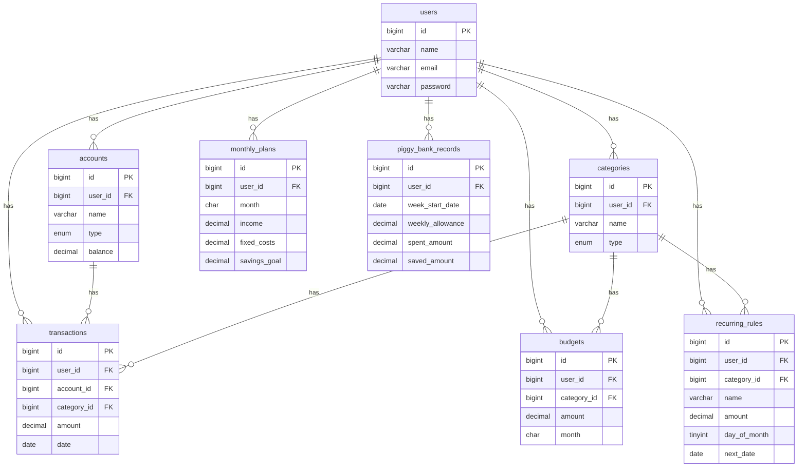

# Kakeibo

個人向け家計簿・支出管理Webアプリ。「今月あと使える金額」が分からず使いすぎてしまう人に向けて、
支出を引き算（マイナス）ではなく、使わなかった分が「貯金箱」に貯まるプラスの報酬として可視化する
ポジティブフレーミングの家計簿SPAです。

損失回避バイアス（同額の損失は利得の約2倍重く感じる）を踏まえ、赤字・警告色による表現は避け、
達成・貯蓄はグリーン/ゴールド、注意喚起は控えめなアンバーに限定した配色ポリシーを全画面で統一しています。

## 主な機能

- 1週間の利用可能額の自動算出（手取り − 固定費 − 貯金目標 ÷ 4.3週）とダッシュボード表示
- 「貯金箱」UI：使わなかった差額をプラスの報酬として可視化
- 週次の小さな目標設定・カテゴリ別月間予算とアラート
- 手入力ベースの収支登録（銀行API連携は意図的に非対応）
- 固定費・サブスクの登録と支払いリマインド
- 収支グラフ（月別・カテゴリ別・年間推移）、CSV出力

作らない機能（意図的な除外）: 銀行/カード自動連携、資産運用機能、家族共有機能、赤字を強調する分析グラフ。

## 技術スタック

| 領域 | 技術 |
|---|---|
| バックエンド | PHP 8.3 / Laravel 11 / Laravel Sanctum（SPA Cookie認証） |
| フロントエンド | TypeScript / React 18 + Vite + Tailwind CSS / shadcn/ui / TanStack Query / Recharts |
| DB | MySQL 8 |
| インフラ | Docker（バックエンド・DB） |

## 画面一覧

| 画面ID | 画面名称 | パス |
|---|---|---|
| PG01 | ダッシュボード | `/dashboard` |
| PG02 | 取引一覧 | `/transactions` |
| PG03 | レポート | `/reports` |
| PG04 | 予算設定 | `/budgets` |
| PG05 | 口座管理 | `/accounts` |
| PG06 | カテゴリ管理 | `/categories` |
| PG07 | ログイン | `/login` |
| PG08 | ユーザー登録 | `/register` |
| PG09 | パスワードリセット（メール送信） | `/forgot-password` |
| PG10 | パスワードリセット（再設定） | `/reset-password` |
| PG11 | プロフィール設定 | `/settings/profile` |
| PG12 | 固定費・サブスク管理 | `/recurring-rules` |

## ER図



詳細なテーブル仕様（型・NOT NULL・PK/FK）は `backend/database/migrations` を参照してください。

## ディレクトリ構成

```
kakeibo/
├── backend/          # Laravel 11 API（/api/*）
├── frontend/          # React 18 + Vite SPA
├── docker-compose.yml # MySQL 8 + バックエンドAPIコンテナ
└── README.md
```

## 環境構築

前提: Docker / Docker Compose, Node.js 20+

### 1. バックエンド + DB（Docker）

```bash
cd backend
cp .env.example .env

cd ..
docker compose up -d --build

# コンテナ起動後、初回のみ実行
docker compose exec backend php artisan key:generate
docker compose exec backend php artisan migrate
docker compose exec backend php artisan db:seed   # ダミーデータ投入（任意）
```

API は `http://localhost:8000` で待ち受けます。

### 2. フロントエンド

```bash
cd frontend
cp .env.example .env
npm install
npm run dev
```

`http://localhost:5173` でSPAが起動します。

## テスト

```bash
# バックエンド（PHPUnit）
docker compose exec backend php artisan test

# フロントエンド（Vitest）
cd frontend && npm run test
```

## 設計ドキュメント

要件定義書（機能要件・基本設計書・テーブル仕様書・権限設計・エラーメッセージ設計・状態遷移設計・
トランザクション設計・例外設計・テストケース一覧 等）はプロジェクトのGoogleスプレッドシートを正としています。
